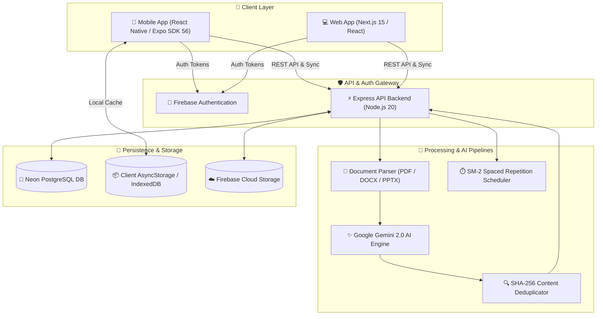
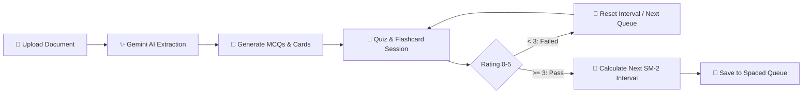

<div align="center">
  
  <h1>Scorr - AI-Powered MCQ & Flashcard Platform</h1>
  <p>
    <strong>Transform documents, presentations, and lecture notes into interactive multiple-choice questions, flashcards, and spaced repetition study sessions.</strong>
  </p>
  <p>
    <a href="https://github.com/shashianand25/Scorr/actions/workflows/ci.yml"></a>
    <a href="LICENSE"></a>
    <a href="#"></a>
    <a href="#"></a>
    <a href="#"></a>
    <a href="#"></a>
  </p>
</div>

<br />

<div align="center">
  
</div>

---

## 📋 Table of Contents

- [✨ Features](#-features)
- [🏛️ System Architecture](#️-system-architecture)
- [🔄 Study & Spaced Repetition Workflow](#-study--spaced-repetition-workflow)
- [🛠️ Tech Stack](#️-tech-stack)
- [🚀 Quick Start & Onboarding](#-quick-start--onboarding)
  - [Option A: Docker Compose (Fastest)](#option-a-docker-compose-fastest)
  - [Option B: VS Code Dev Containers](#option-b-vs-code-dev-containers)
  - [Option C: Manual Local Setup](#option-c-manual-local-setup)
- [🔐 Environment Variables](#-environment-variables)
- [🧪 Testing & Quality Assurance](#-testing--quality-assurance)
- [📂 Monorepo Structure](#-monorepo-structure)
- [📖 API Reference Summary](#-api-reference-summary)
- [🤝 Contributing](#-contributing)
- [📜 Changelog](#-changelog)
- [📄 License](#-license)

---

## ✨ Features

- **🧠 Multi-Modal AI Question Generation**: Upload PDFs, PowerPoint (`.pptx`), Word documents (`.docx`), or raw text to generate high-yield MCQs and active-recall flashcards with Google Gemini 2.0.
- **📈 SuperMemo-2 (SM-2) Spaced Repetition**: Scientifically proven scheduling algorithm that calculates optimal card review intervals, ease factor bounding, and repetition buckets to maximize long-term retention.
- **⚔️ Real-Time Multiplayer Battle Arena**: Challenge peers in live quiz battles with real-time scoring, synchronized room countdowns, and milliseconds speed tiebreakers.
- **⚡ Zero-Config Offline-First Engine**: Complete offline study support with background sync, automatic dirty-flag reconciliation, and SHA-256 fingerprint deduplication.
- **📊 Granular Learning Analytics**: Track mastery heatmaps, speed metrics, accuracy percentages, and review wrong answers.
- **🌐 Multilingual Localization**: Full native language support for English, Spanish, Russian, and Hindi.

---

## 🏛️ System Architecture

The following diagram illustrates the end-to-end architecture across client applications, gateway services, AI inference pipelines, and persistent storage:



---

## 🔄 Study & Spaced Repetition Workflow



---

## 🛠️ Tech Stack

| Tier | Technologies |
| :--- | :--- |
| **Mobile App** | React Native, Expo SDK 56, Expo Router, TypeScript, React Native Reanimated |
| **Web App** | Next.js 15 (App Router), React 19, Tailwind CSS, TypeScript |
| **Backend API** | Node.js 20, Express, PostgreSQL, Neon Serverless, pg-pool |
| **AI & ML** | Google Gemini 2.0 Flash / Pro API, OfficeParser, PDF-Parse, Mammoth |
| **Testing** | Jest, Babel-Jest, Node Test Runner, TSX, 34 Test Suites (95+ tests) |
| **CI / CD** | GitHub Actions Matrix Pipeline, Dependabot, Renovate |
| **Containers** | Docker, Docker Compose, VS Code Dev Containers |

---

## 🚀 Quick Start & Onboarding

### Option A: Docker Compose (Fastest)

Run the entire stack (PostgreSQL + Express Backend + Next.js Web) in a single command:

```bash
# 1. Clone the repository
git clone https://github.com/shashianand25/Scorr.git
cd Scorr

# 2. Copy environment template
cp .env.example .env

# 3. Launch all services
docker-compose up --build
```
- **Backend API**: `http://localhost:3000`
- **Web App**: `http://localhost:3001`
- **PostgreSQL**: `localhost:5432`

---

### Option B: VS Code Dev Containers

1. Open the repository in **VS Code**.
2. Click **Reopen in Container** when prompted (or open Command Palette -> `Dev Containers: Reopen in Container`).
3. Dependencies and tooling will automatically install inside the isolated container.

---

### Option C: Manual Local Setup

#### Prerequisites
- Node.js `v20.0.0` or higher
- npm `v9.0.0` or higher
- (Optional) PostgreSQL instance

#### 1. Repository Setup & Dependencies (Fresh Clone)
```bash
# Clone the repository
git clone https://github.com/shashianand25/Scorr.git
cd Scorr

# Install all monorepo workspace dependencies reproducibly
npm install

# Run the complete test suite (38 suites / 115+ tests)
npm test

# Build production assets
npm run build
```

#### 2. Configure Environment Files
```bash
cp .env.example .env
cp apps/api/.env.example apps/api/.env
cp apps/mobile/.env.example apps/mobile/.env
cp apps/web/.env.example apps/web/.env
```

#### 3. Run Backend API
```bash
npm run dev
# or: cd apps/api && npm run dev
```

#### 4. Run Mobile App (Expo)
```bash
cd apps/mobile
npx expo start
```

#### 5. Run Web Frontend
```bash
npm --prefix apps/web run dev
# or: cd apps/web && npm run dev
```

---

## 🔐 Environment Variables

All environment variables have documented defaults and placeholders in [`.env.example`](.env.example):

| Variable | Scope | Description |
| :--- | :--- | :--- |
| `DATABASE_URL` | Backend | PostgreSQL / Neon connection string with SSL mode |
| `GEMINI_API_KEY` | Backend / Mobile | Google Gemini API key for question generation |
| `EXPO_PUBLIC_API_URL` | Mobile | Base URL pointing to the Scorr backend server |
| `NEXT_PUBLIC_API_URL` | Web | Base URL pointing to the Scorr backend server |
| `EXPO_PUBLIC_POSTHOG_KEY` | Mobile | PostHog telemetry & product analytics API key |
| `RESEND_API_KEY` | Backend | Resend API key for transactional emails |

---

## 🧪 Testing & Quality Assurance

Scorr enforces a multi-tier test matrix with over **38 test suites and 115+ automated unit tests**:

```bash
# Run ALL test suites across Mobile, Web, and Backend (Default test command)
npm test

# Alternatively:
npm run test:all

# Run Mobile tests with Jest (31 suites / 101 tests)
npm run test:mobile

# Run Mobile TypeScript typecheck
npm run typecheck

# Run Web test suites (4 suites / 7 tests)
npm run test:web

# Run Backend test suites (3 suites / 7 tests)
npm run test:backend

# Run Monorepo Linting (ESLint across Mobile & Web)
npm run lint

# Build Web Application
npm run build
```

---

## 📂 Monorepo Structure

```text
Scorr/
├── .devcontainer/          # VS Code Dev Container definitions
├── .github/
│   ├── dependabot.yml      # Dependabot automated dependency updater
│   └── workflows/
│       ├── ci.yml          # Multi-tier GitHub Actions CI pipeline (runs on every push)
│       ├── build.yml       # Production build verification pipeline
│       ├── lint.yml        # ESLint & typecheck pipeline
│       └── security.yml    # Automated vulnerability audit pipeline
├── apps/
│   ├── api/                # Express API, document parsers, database adapters
│   │   ├── __tests__/      # Backend test suites (API, Deduplication, Sanitization)
│   │   ├── api/            # Express routes and controllers
│   │   ├── db/             # Neon PostgreSQL pool and schemas
│   │   ├── Dockerfile      # Backend container image definition
│   │   ├── vercel.json     # Vercel serverless API deployment config
│   │   └── package.json
│   ├── mobile/             # React Native / Expo SDK 56 mobile app
│   │   ├── src/
│   │   │   ├── __tests__/  # 31 Jest unit test suites (Utils, Hooks, Screens, Components)
│   │   │   ├── components/ # UI design system components
│   │   │   ├── hooks/      # React state hooks and session management
│   │   │   ├── lib/        # Algorithm implementations & telemetry
│   │   │   └── screens/    # Screen views (Home, Battle, Flashcards, Library)
│   │   ├── babel.config.js # Babel transpilation configuration
│   │   ├── jest.config.js  # Jest unit test configuration
│   │   └── package.json
│   └── web/                # Next.js 16 web application
│       ├── src/__tests__/  # Web algorithmic parity test suites
│       ├── src/app/        # Next.js App Router pages
│       ├── Dockerfile      # Next.js container image definition
│       └── package.json
├── packages/               # Shared workspace packages
├── CHANGELOG.md            # Version release history and updates
├── Dockerfile              # Monorepo production multi-stage Dockerfile
├── docker-compose.yml      # Multi-container orchestration
├── eas.json                # Expo Application Services configuration
├── package.json            # Monorepo root manifest and workspace scripts
├── package-lock.json       # Deterministic lockfile for reproducible builds
├── renovate.json           # Renovate bot automated upgrade rules
└── README.md
```

---

## 📖 API Reference Summary

| Method | Endpoint | Description |
| :--- | :--- | :--- |
| `GET` | `/api/config` | Fetches app version policies and emergency maintenance flags |
| `POST` | `/api/feedback` | Submits user bug reports and feature requests |
| `POST` | `/api/generate` | Extracts document content and generates AI MCQs & flashcards |
| `POST` | `/api/battles/create` | Initializes a new multiplayer battle room |
| `POST` | `/api/battles/join` | Joins an existing battle room with a 6-character room code |

---

## 🤝 Contributing

Contributions are welcome! Please follow these steps:

1. Fork the project repository.
2. Create your feature branch (`git checkout -b feature/NewFeature`).
3. Ensure all tests pass (`npm run test:all`).
4. Commit your changes following Conventional Commits (`git commit -m 'feat: add NewFeature'`).
5. Push to your branch (`git push origin feature/NewFeature`).
6. Open a Pull Request against `main`.

---

## 📜 Changelog

See [`CHANGELOG.md`](CHANGELOG.md) for detailed release notes and migration guides.

---

## 📄 License

Distributed under the MIT License. See [`LICENSE`](LICENSE) for more information.

<div align="center">
  <sub>Crafted with ❤️ by <a href="https://github.com/shashianand25">Shashi Anand</a></sub>
</div>
