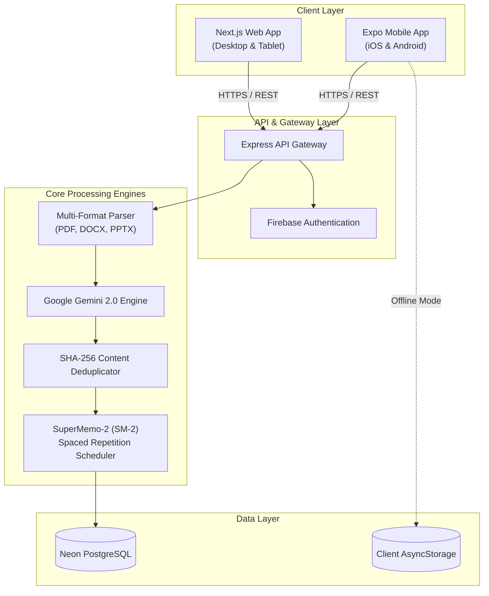

# System Architecture & Technical Specifications

This document outlines the architectural design, algorithmic models, data structures, and infrastructure of **Scorr**.

---

## 1. System Overview

Scorr is an AI-augmented education and spaced repetition platform organized as a modular monorepo:
- **Mobile Tier**: React Native & Expo SDK 56 cross-platform client with offline persistence.
- **Web Tier**: Next.js 15 web client providing web previews and account management.
- **Backend Tier**: Node.js & Express REST API managing document processing, database persistence, and Google Gemini AI orchestration.
- **Database Tier**: Neon PostgreSQL serverless relational database.

---

## 2. Architecture Diagram



---

## 3. SuperMemo-2 (SM-2) Spaced Repetition Algorithm

Scorr implements the standard SM-2 algorithm to schedule card reviews:

### Formula
Given a quality grade q in {0, 1, 2, 3, 4, 5}:

1. **Ease Factor Update**:
   EF' = EF + (0.1 - (5 - q) * (0.08 + (5 - q) * 0.02))
   Bounded by: EF' >= 1.3

2. **Interval Calculation**:
   - If q < 3: Interval = 1 day, repetitions = 0 (Card reset)
   - If q >= 3:
     - Repetition 1: Interval = 1 day
     - Repetition 2: Interval = 6 days
     - Repetition n > 2: Interval_n = Interval_(n-1) * EF'

---

## 4. Deduplication & Content Fingerprinting

To prevent redundant uploads and save cloud resources, Scorr generates deterministic SHA-256 hashes based on normalized content text:

```typescript
function generateContentHash(title: string, questions: Question[]): string {
  const normalized = questions
    .map(q => `${q.question.trim().toLowerCase()}|${q.options.map(o => o.trim()).sort().join(',')}`)
    .sort()
    .join('||');
  return crypto.createHash('sha256').update(normalized).digest('hex');
}
```

---

## 5. Security & Isolation

- **Zero-Secret CI Execution**: All automated tests run on sandboxed in-memory mocks without requiring live .env secrets.
- **Payload Sanitization**: Server-side document parsers strip null bytes and normalize multi-byte UTF-8 encodings.
- **Tombstone Sync**: Deletions are synced via cryptographic IDs preventing phantom resurrects during offline reconnections.
