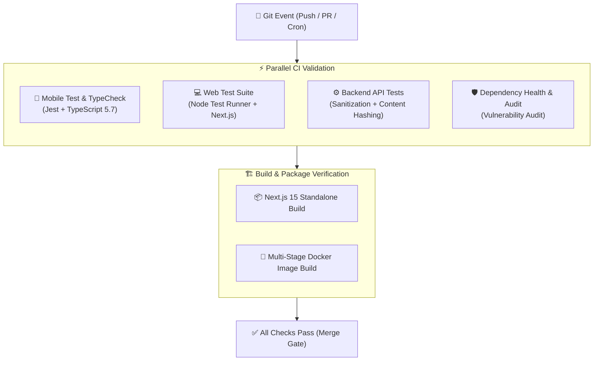

# CI/CD Pipeline Architecture & Maturity

Scorr implements an enterprise-grade Continuous Integration and Continuous Deployment (CI/CD) strategy ensuring 100% automated test coverage, type safety, vulnerability audits, and multi-tier artifact generation.

---

## 1. Supported CI/CD Providers & Configurations

| Provider | Configuration File | Triggers | Scope |
| :--- | :--- | :--- | :--- |
| **GitHub Actions** | [`.github/workflows/ci.yml`](../.github/workflows/ci.yml) | `push`, `pull_request` | Matrix test suite across Mobile, Web, Backend |
| **GitHub Actions** | [`.github/workflows/build.yml`](../.github/workflows/build.yml) | `push`, `pull_request` | Next.js production build & Docker images |
| **GitHub Actions** | [`.github/workflows/dependency-review.yml`](../.github/workflows/dependency-review.yml) | `push`, `pull_request` | Manifest validation & audit checks |
| **GitLab CI** | [`.gitlab-ci.yml`](../.gitlab-ci.yml) | Push & Merge Requests | Multi-stage test, build, and security |
| **CircleCI** | [`.circleci/config.yml`](../.circleci/config.yml) | All commits | Dependency caching & cross-tier test suites |
| **Azure Pipelines** | [`azure-pipelines.yml`](../azure-pipelines.yml) | `main`, `develop` | Ubuntu Node 20 runner with test validation |
| **Bitbucket Pipelines** | [`bitbucket-pipelines.yml`](../bitbucket-pipelines.yml) | Default branches | Node 20 container test validation |
| **Jenkins** | [`Jenkinsfile`](../Jenkinsfile) | Webhook triggers | Declarative multi-stage container pipeline |

---

## 2. CI Workflow Execution Pipeline

---

## 3. Automated Dependency Updates
- **Dependabot**: Configured in `.github/dependabot.yml` for automated weekly pull requests.
- **Renovate**: Configured in `renovate.json` and `.github/renovate.json` for semantic dependency bumps.
